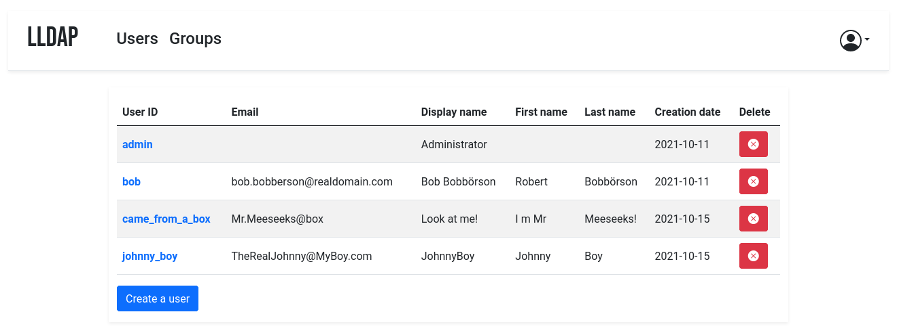
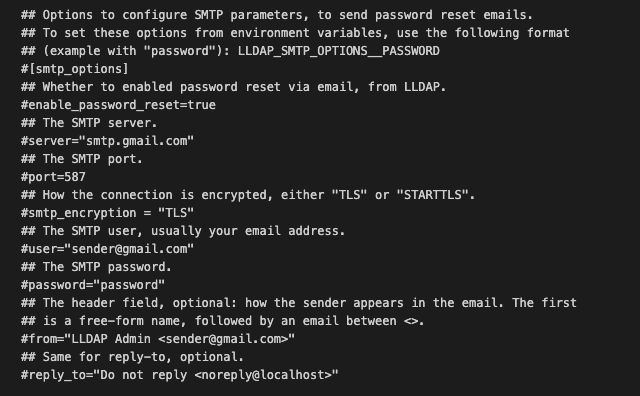

# Light LDAP CI/CD pipeline

Deploy Light LDAP server with CI/CD on Elestio

 
 

# Once deployed ...

You can open Light LDAP UI here:

    URL: https://[CI_CD_DOMAIN]
    Login: root
    password: [ADMIN_PASSWORD]

## Configuring SMTP server for password recovery

If you want to configure the SMTP server, go to Build&Deploy section, open the Environment variables tab, and change the variables that begins with "LLDAP_SMTP_OPTIONS\_\_" with your credentials.
You can use the image below

